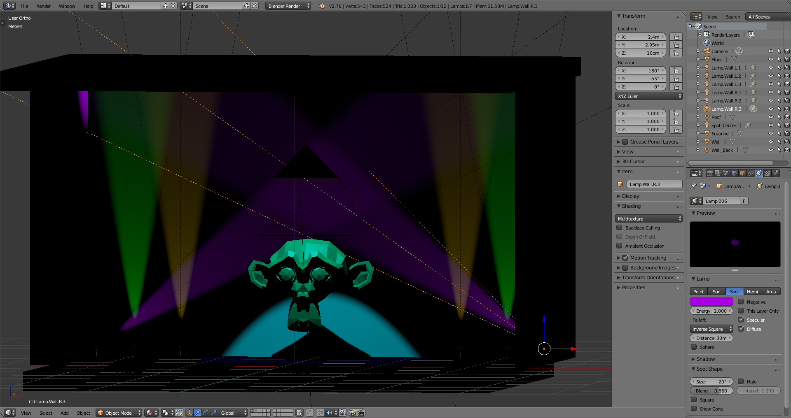
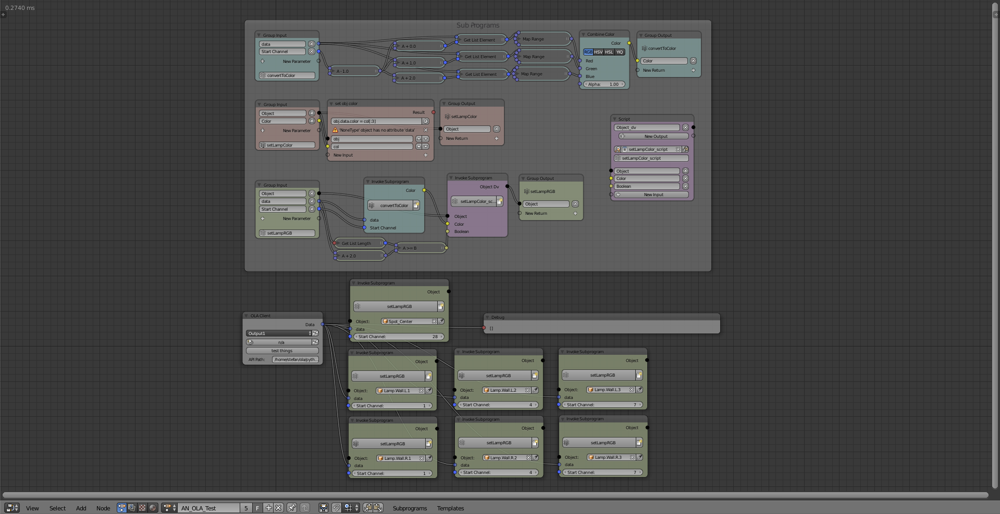
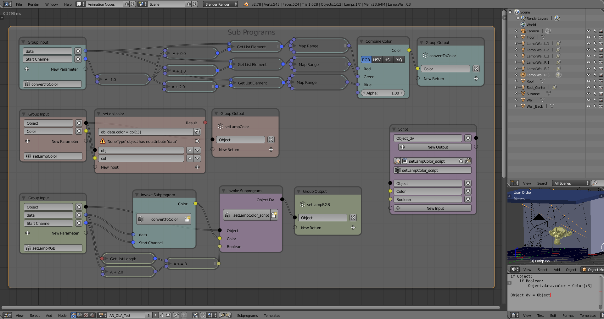
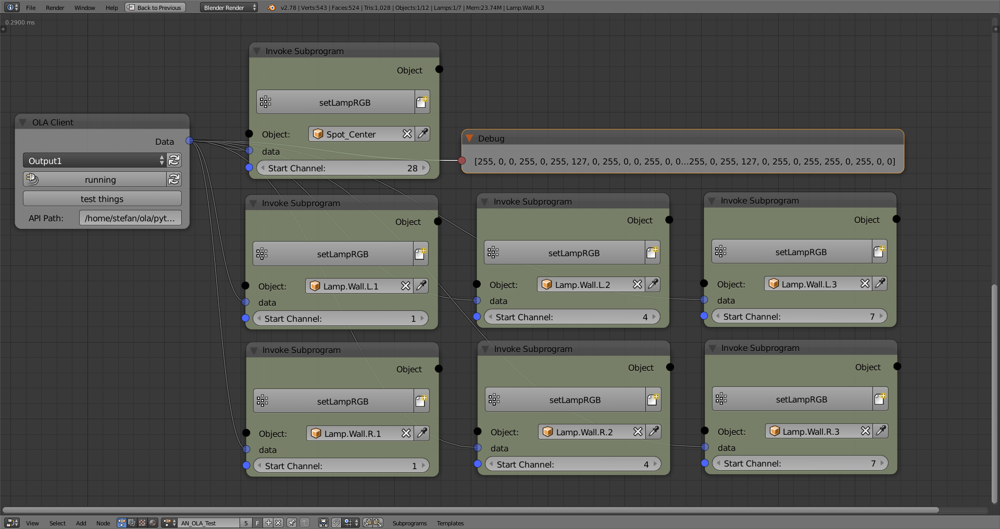
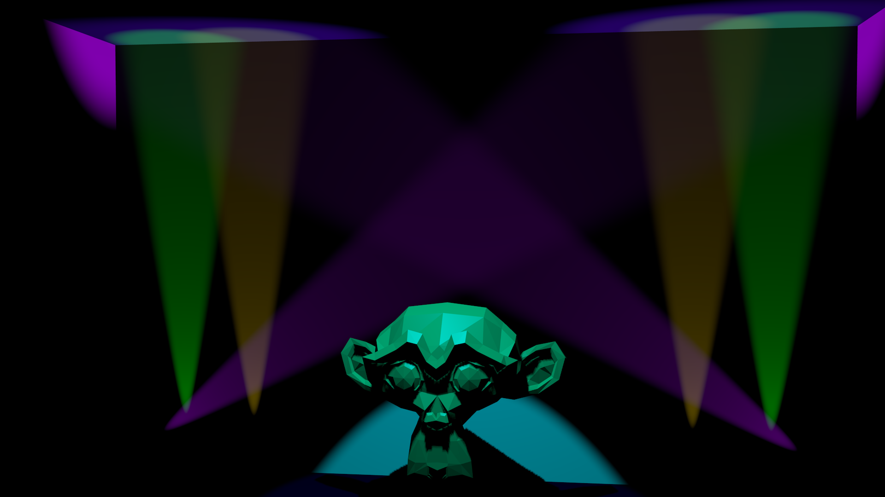

# OLA_Blender_AnimationNodes_Example
Example for Combinations of OLA and Blender Animation Nodes for 'Realtime Light Simulation'

## Demo-Test
a simple demonstration of my experimental [OLA-Node](github.com/s-light/animation_nodes/tree/OLANode/nodes/ola).

The Setup is as following:
'Lightshow' is generated by [e:cue Programmer](ecue.com/products/software/lighting-application-suite-70.html)
this outputs the same data as
* e:net to a e:cue butler classic. The DMX-Output is connected to some [Pixel-LED-Strips (10Pixel/25cm)](schnickschnacksystems.com/en/products/led-strips/led-strips-c/)
* ArtNet

e:cue is running inside a VirtualBox Win7_64bit system.  
on the same computer at native level (Kubuntu 16.04 64bit) [OLA](https://www.openlighting.org/ola/) is running and receiving the ArtNet data.

In Blender i have Build a minimalist scene:  
* it contains a 'Room' (only back wall is visible).
* in front of this wall i have positioned 10 Spot-Lamps each 2.5cm apart.
* With the help of the [Animation Node project](github.com/JacquesLucke/animation_nodes) i have added [a experimental new node](github.com/s-light/animation_nodes/tree/OLANode/nodes/ola)
this node connects to OLA as Client and receives the DMX-Data and outputs it as IntegerList.
* Than i have made a simple node setup to set the Lamp-Colors from the List data.
* the Blender 3D-View 'Viewport Shading' is set to Textured.
* With this on my maschine it gets really slow - but the lightoutput is visible in the Viewport! :-)

you can find all the used files for this (and some other tests) in this [repository](https://github.com/s-light/OLA_Blender_AnimationNodes_Example).

video of 'demo_test'[Testing: ecue Programmer -&gt; ArtNet -&gt; OLA -&gt; Blender Animation Nodes](https://vimeo.com/190378830)
<iframe src="https://player.vimeo.com/video/190378830" width="640" height="360" frameborder="0" webkitallowfullscreen mozallowfullscreen allowfullscreen></iframe>

## Some other Simple Tests

Room build wiht FreeCAD (Simple_Room.fcstd)   
exported as obj/stl (Simple_Room.obj / Simple_Room.stl) (http://freecadweb.org/wiki/index.php?title=Arch_tutorial#Rendering)  
imported to blender.

Ready to go blend file: simple_test.blend

